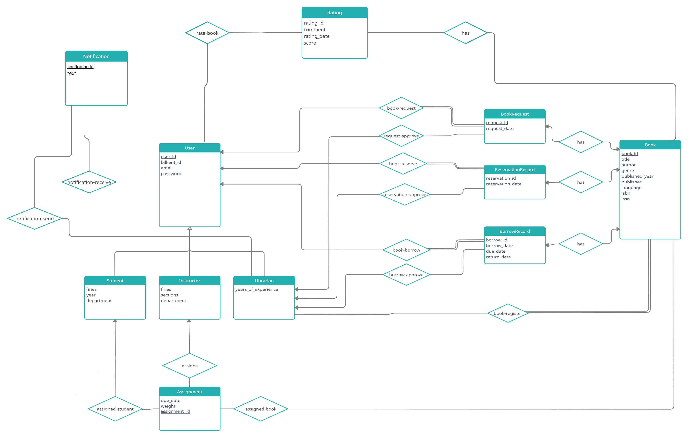

# CS353 Database Systems - Spring 2022

<h1>Term Project Proposal</h1>
<h1>Group 24</h1>
<h1>School Library System</h1>
 

Ali Doğaç Urkaya - 21903213 - Section 3

Özgür Abi - 21902358 - Section 3

Jankat Berslan Dinçer - 21902035 - Section 3

Serhat Gürgenyatağı - 21903288 - Section 3

<h2>Introduction</h2>

For this project, we are going to be designing a library system. This system will be used by both the instructors and the students, and it will be managed by librarians. Users will be able to browse books by title, author, genre, year, etc. Instructors will be able to assign students books as homework. Homework will be assigned in the form of a notification prompting the students to borrow specific books from the system. Users will be able to request books from the library system, and these requests will be managed by librarians. If the book exists in the system and is not currently held by another user, the user will be able to borrow books. Users will be able to put books on hold if they are available in the system but are currently held by another user. After they are done, they will be able to return the books to the system, which will need to be approved by librarians. Borrowed, returned, and on-hold books will be stored in the users’ accounts. Librarians will be able to see people’s accounts and register new accounts or books to the system. Librarians will be able to send warnings to users to return their books. Warnings and homework notifications will be visible to users on their accounts. Students will be able to make requests to the system by sending notifications to librarians if a book they were looking for does not exist in the system. If a user has borrowed a book and the book is due soon but the student still needs the book, they can request an extension to their time with the book.

<h2>Databases Used in the System</h2>

In this project, the database is going to be used for information storage and alterations. The database is going to store information about books (title, author, hold status, etc.) and users (login credentials, held books, hold requests, notifications, etc.). There will be 3 user types in our application: Students, instructors and librarians. Each will have different functions to interact with the database. The database will be updated according to actions of each user in the system. In order to store all this information and make the information alterable by different parties, we need a database where all parties can interact.

<h2>Requirements</h2>
<h3>Functional Requirements</h3>
<h4>Students</h4>

Students should be able to view books and sort through them based on certain criteria.

Students should be able to request to borrow books.

Students should be able to put books on hold.

Students should be able to return books.

Students should be able to rate books.

Students should be able to request extensions for their books’ due dates.

Students should be able to view their notifications such as warnings for late books or given homework.

<h4>Instructors</h4>

Instructors should be able to assign books to students as homework.

Instructors should also be able to borrow books, put them on hold, and return them the same way students can.

<h4>Librarians</h4>

Librarians should be able to view other accounts.

Librarians should be able to register new accounts.

Librarians should be able to register new books.

Librarians should be able to warn people if books they hold are due.

<h3>Non-functional Requirements</h3>

Security: We will keep user data secure by encrypting sensitive information of users.

Usability: We will make sure the program is easy to learn and use.

Performance: We will make sure the program runs smoothly even on low-end devices.

Reliability: The system will be up 24/7 with minimal downtime. If necessary, maintenance will be done during off-hours

<h3>Constraints</h3>

We will use MySQL to implement the database.

Website will be designed with HTML and CSS, and its back-end functions will be implemented with Java Spring.

<h2>Limitations</h2>

Students and instructors can only request to borrow books that are currently in the system and not held by anyone else. They will be prompted to put the book on hold instead if they try to request a book held by someone else.

Users cannot borrow books without their requests being approved by librarians first.

Users cannot return books without it being approved by librarians.

Librarians can only send warnings to users if a book they are holding is due.

Librarians can only create one account per user. This will be enforced by linking users’ Bilkent IDs to their accounts.

<h2>Conceptual Design</h2>
